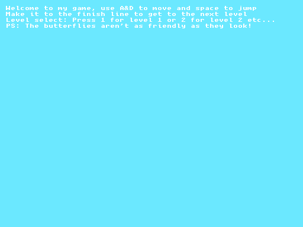
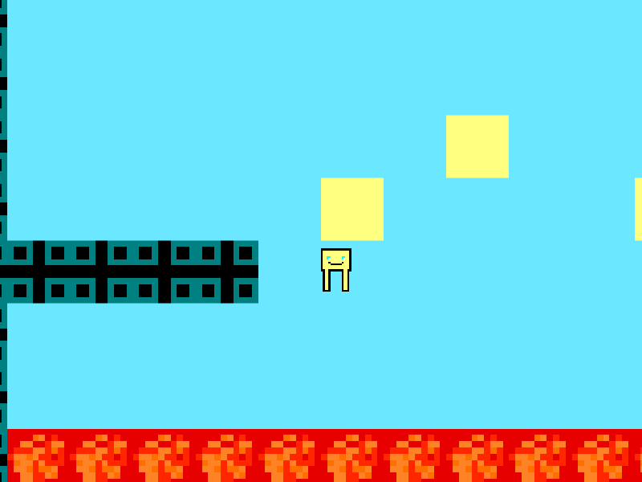
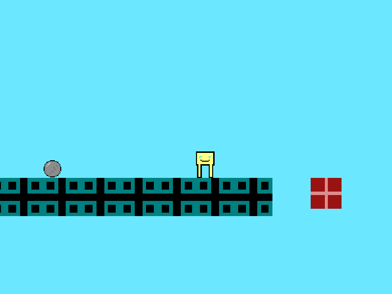

# EPQ Platformer

A five-level 2D platformer built for my sixth-form Extended Project Qualification (EPQ),
using [Kaboom.js](https://kaboomjs.com) 0.5 and pixel art drawn in Kaboom's sprite editor.

**[Play it in your browser](https://henryforrest.github.io/epq-platformer/)**



## Controls

| Key | Action |
| --- | --- |
| A / D | Move left / right |
| Space | Jump |
| 1 to 5 | Pick a level from the menu |
| Enter | Back to the menu from the game-over or end screen |

## What's in it

- Five hand-built levels with a rising difficulty curve, ending in a long final stage that mixes every mechanic.
- Trampolines that supercharge your next jump, blocks that crumble half a second after you touch them,
  lava, spikes, butterflies that are not your friends, boulders that drop from above, and bricks that
  slide away when you land on them until they smash against a wall.
- Hidden sky-coloured platforms (and one hidden wall) in the last level.
- A menu with level select, and a game-over screen that retries the level you died on.

| Level 3: breaking blocks over lava | Level 4: a boulder and a sliding brick |
| --- | --- |
|  |  |

## Running it locally

The sprites are loaded with `fetch`, so the game has to be served over HTTP rather than opened as a file:

```bash
python3 -m http.server 8000
```

Then open <http://localhost:8000>.

## How it's built

- `index.html` loads the engine and the game.
- `game.js` holds everything else: asset loading, tuning constants, the five level maps as text grids,
  and four scenes (menu, level, game over, end). All five levels run through one `level` scene, driven
  by a small settings object per level (tile size, spawn point, butterfly size, brick slide speed).
- `sprites/` holds the hand-drawn sprites in Kaboom's `.kbmsprite` format (raw RGBA pixel arrays).
- `lib/` holds Kaboom 0.5.0 and its sprite loader, vendored so the game does not depend on a CDN
  staying up. Kaboom is MIT licensed; see `lib/LICENSE-kaboom.txt`.

## History

The game was originally written in the Kaboom playground and exported as a single 700-line HTML file,
with each level and each game-over screen copy-pasted. The original export is the first commit in this
repository. In 2026 it was cleaned up:

- the five level scenes became one parameterised scene, and the five game-over scenes became one;
- the boulder got a sprite (the original file was accidentally blank, which made it an invisible trap);
- the level 1 finish moved one tile closer, because the original gap could only be cleared from a
  single two-pixel strip at the edge of the last platform;
- brick contact was folded into one collision handler, since Kaboom 0.5 only ever fires the first
  handler registered per tag on an object;
- the canvas now follows the window size, unused sprites were removed and the engine was vendored.

## What I learned

- How a game loop, collision detection and gravity fit together in practice.
- Designing levels as text grids and building up a small set of reusable hazards.
- Why duplicated code is a trap: the original had five copies of the level logic and five copies of the
  game-over screen, and the refactor cut each to one.
